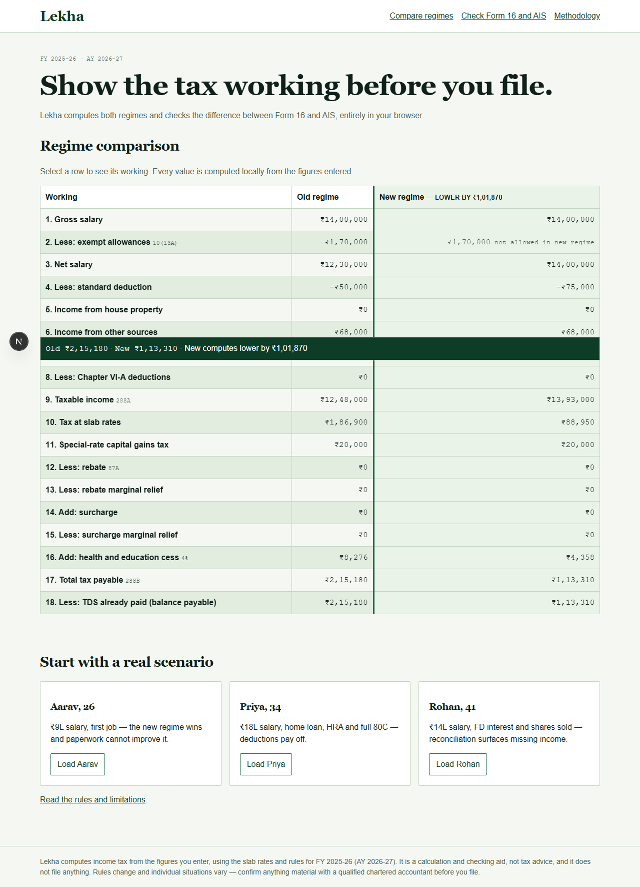

# Lekha — your ITR assistant

Lekha compares the FY 2025-26 old and new tax regimes for a salaried Indian taxpayer, showing every calculation line. It also reconciles employer Form 16 data against AIS entries to surface mismatches before filing. It is intentionally a calculation and checking aid, not an e-filing product.



## Run locally (five minutes)

```bash
npm install
npm run dev
```

Open `http://localhost:3000`. No account, environment file, API key, database, or network call is required for the three core engines.

## Deploy to Vercel (five minutes)

1. Push this repository to GitHub or import the folder in the Vercel dashboard.
2. Select the repository; Vercel detects Next.js automatically.
3. Leave build settings at their defaults (`npm run build`) and deploy.
4. Optionally add `OPENAI_API_KEY` only for explanation-layer enhancement; calculated values never use it.

## Architecture

- `data/tax-rules/fy-2025-26.json` is the single versioned source for rates, caps, slabs, thresholds and tolerances.
- `lib/tax` is pure deterministic TypeScript for regime comparison and break-even calculation.
- `lib/reconcile` is pure deterministic TypeScript, one detector per flag type.
- `app` and `components` render the local, shareable web experience.

### Deterministic versus optional LLM

Every rupee value, tax comparison, deduction cap, flag and risk score is deterministic local TypeScript. An optional API endpoint may label a pre-computed explanation as enhanced when an API key exists, but it does not calculate, alter or validate any number. The app is complete without a key.

## Limitations

Lekha deliberately does not parse real Form 16/AIS PDFs: layouts vary and silent extraction mistakes are unacceptable in a tax tool. Enter structured JSON instead. It does not cover business/professional income, foreign income or assets, crypto/VDA, clubbing, presumptive taxation, revised/belated-return rules, advance-tax interest, e-filing or user accounts. Dark mode is deliberately absent so there is no hollow toggle.

## 90-second demo

1. Open **Compare regimes** and load Rohan from the landing page.
2. Read the side-by-side ledger and its tax difference.
3. Drag the break-even deductions control and see the explored old-regime tax update.
4. Open **Check Form 16 and AIS**, then load both samples.
5. Expand the risk score to see the four undeclared income sources, duplicate exclusion and score working.

## Commands

```bash
npm run typecheck
npm run lint
npm test
npm run build
npm run test:e2e
```

> Lekha computes income tax from the figures you enter, using the slab rates and rules for FY 2025-26 (AY 2026-27). It is a calculation and checking aid, not tax advice, and it does not file anything. Rules change and individual situations vary — confirm anything material with a qualified chartered accountant before you file.
